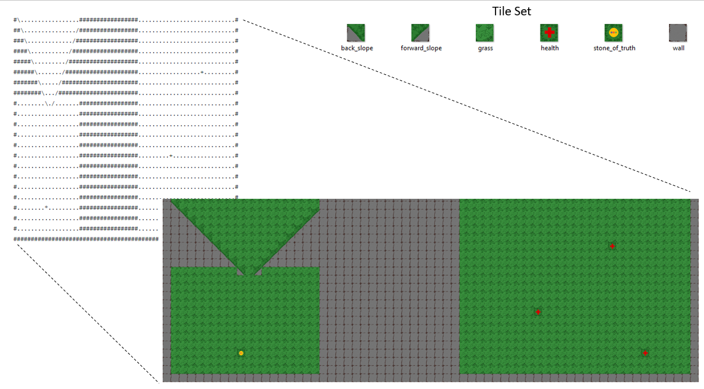

### Bring your ASCII worlds to life! A picture is worth 1000 words as they say.

In a nutshell this program translates level01.txt into final_map.png
The cool thing is that level01.txt, could be any text file, and
the tiles can be whatever you want (see png_input folder)

The actual implementation takes in .png files from the png_input folder and transforms
them into .tga files for easy manipulation of pixels. Given a pre-made
level in the level folder (containing a .txt file), the program translates
each character into a tile and stitches the tiles together accordingly.

Essentially:

input png --> translate to TGA --> stich pixels according to text file --> write a new .png (your map!)

Commentary:
This project took a lot more work than I originally expected.
I had to look into the different compression methods of .tga and .png. 
I knew what big/little-endian was, but I found out (the hard way) why its important
to understand. I learned there are a lot more to binary file formats
than I intially thought. I learned some cool bit manipulation magic. 
I also rewrote a siginificant portion of the TGA class becuase
I was dealing with a HUGE number of pixels, and so performance was very important.
I can definitely see myself coming back to this project to add more functionality, but
for now I just want to share what I have.
